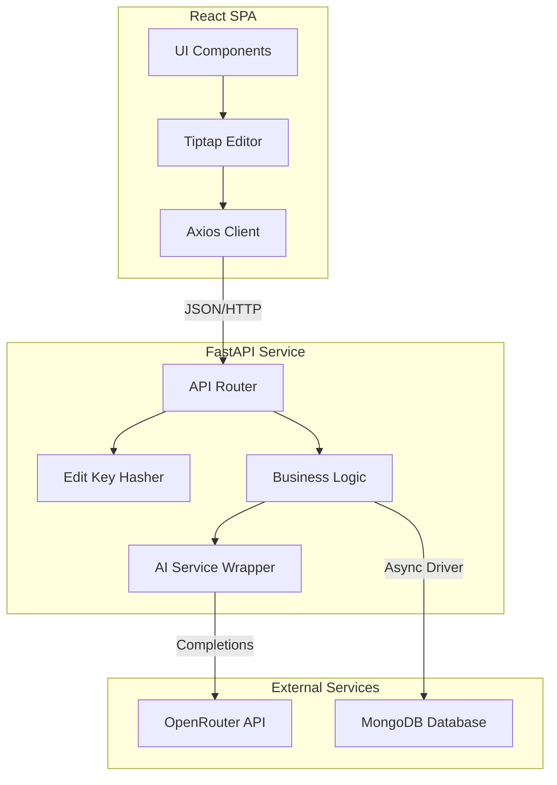

# InsightPress - Project Explanation

## 1. Project Overview
**InsightPress** is a modern, AI-augmented blogging platform that reimagines the writing experience by blending a sophisticated rich-text editor with a context-aware AI assistant. Unlike traditional CMS platforms that treat AI as an afterthought, InsightPress embeds the `minimax-m2.5` model directly into the authoring workflow, acting as a "Co-Author" that helps ideate, polish, and synthesize content in real-time.

The platform is built on a high-performance stack comprising **FastAPI** (Python) for the backend, **React** (Vite + Tailwind V4) for the frontend, and **MongoDB** for flexible, schema-less data storage.

## 2. System Architecture

## 3. Core Components

### Frontend: The Reactive Interface
*   **Editor Engine**: At the heart of the application is a custom implementation of **Tiptap**, a headless editor framework based on ProseMirror. This allows for a "Notion-like" block-based editing experience while outputting clean, serializable JSON/HTML.
*   **State Management**: Complex editor states and AI interactions are managed locally within components. Operations like AI generation leverage dedicated loading states (`aiLoading`) completely disconnected from generic form-submission states to guarantee robust concurrency.
*   **Typography Rendering**: Utilizes the `@tailwindcss/typography` (`.prose`) plugin to fluidly parse and style dynamic raw-HTML returns natively within the browser DOM.
*   **AI Integration**: The `WriteBlog` component features a dedicated AI toolbox. When a user requests an outline or polish, the frontend sends the current editor context to the backend, enabling the AI to provide relevant suggestions rather than generic advice.

### Backend: High-Performance Logic
*   **FastAPI Framework**: Chosen for its native asynchronous support (critical for handling non-blocking AI API calls) and automatic Pydantic data validation.
*   **Prompt Engineering Architecture**: Uses rigorously isolated system prompts that enforce rigid formatting bounds. For example, `summarizer_service` explicitly prohibits markdown formatting to guarantee safely-truncatable raw strings, while `writing_service` demands strictly nested HTML outputs for direct frontend insertion.
*   **Service Layer Pattern**: Business logic is strictly separated from API routes.
    *   `writing_service`: Handles outline generation and HTML-formatted content polishing.
    *   `sentiment_service`: Analyzes text tone (Positive, Neutral, Inspiring).
    *   `summarizer_service`: Automatically generates condensed, robust plain-text meta-descriptions.
*   **Security (The "Edit Key" System)**: Instead of a traditional User/Password auth system, InsightPress uses a decentralized "Edit Key" approach.
    *   When a post is created, the user provides a passphrase.
    *   This passphrase is hashed using **SHA-256** and stored with the document.
    *   Updates/Deletes require the original passphrase, which is hashed and compared against the stored hash. This allows for anonymous but secure ownership.

### Data Layer: Flexible Storage
*   **MongoDB**: Utilized for its document-oriented nature, which maps perfectly to the variable structure of blog posts and their metadata.
*   **Motor**: The asynchronous MongoDB driver ensures that database operations do not block the main application thread, allowing the server to handle high concurrency.

## 4. Key Innovations & Features

### The "Co-Author" Workflow
InsightPress treats AI as a collaborative partner.
1.  **Drafting**: The user inputs a title and requests an **Outline**. The AI generates a structured skeleton.
2.  **Refining**: As the user writes, they can select text and request **Polish**, transforming rough notes into professional prose.
3.  **Publishing**: Upon submission, the backend automatically triggers:
    *   **Sentiment Analysis**: Tags the post with a mood.
    *   **Summarization**: Creates a meta-description for card views.
    *   **Reading Time**: Calculates estimated time to read.

### Dual-State Rendering
The system handles content in two distinct states to balance power and security:
*   **Edit State**: Rich, block-based JSON that supports real-time manipulation.
*   **View State**: Sanitized HTML rendered via `dangerouslySetInnerHTML` (with strict sanitation rules) to prevent XSS while maintaining visual fidelity.
